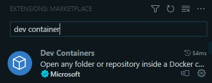
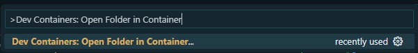
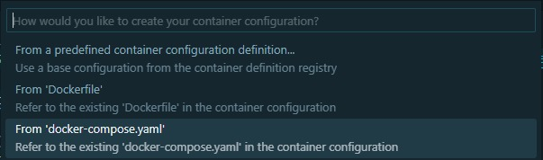

```bash
cd live-imersao-13-remote-container && code .
```

Instale a extensão `Dev Container`:



Acesse o atalho para abrir o `Dev Container` com o comando abaixo:

`ctrl + shift + p`

Digite no campo de busca: `Dev Containers: Open Folder in Container...`



Confirme se o caminho apresentado é o mesmo onde está localizado o `docker-compose.yaml`.

Selecione a opção `From 'docker-compose.yaml'`



Caso opte por instalar alguma feature adicional marque a opção desejada e clique em `Ok` que o `Dev Container` irá iniciar.
